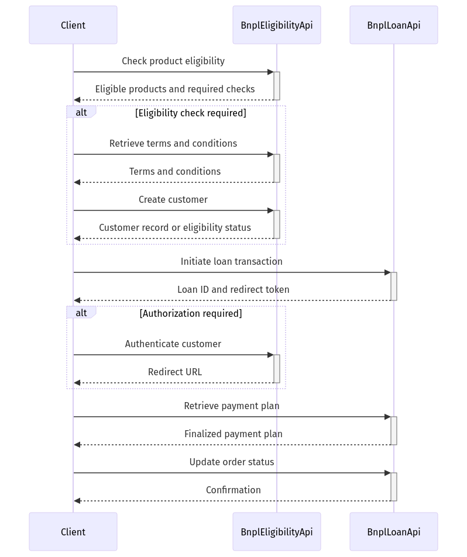

# Getting Started: BNPL Loan Application Workflow

## Overview

The **BNPL Loan Application Workflow** enables developers to integrate a seamless "Buy Now, Pay Later" (BNPL) loan application experience into their platforms. By automating critical processes like product eligibility verification, customer authentication, and loan finalization, this workflow ensures an efficient checkout experience for customers.

> **Developer Tip**: Use this workflow to reduce friction during checkout and ensure eligibility and loan processes are completed in real time.

---

## Step Overview Table

The workflow consists of the following steps:

| #  | Step ID                              | Description                                                                                     | Operation ID                                      | Outputs                                                                                        |
|----|--------------------------------------|-------------------------------------------------------------------------------------------------|--------------------------------------------------|------------------------------------------------------------------------------------------------|
| 1  | `checkProductEligibility`            | Verifies if selected products are eligible for BNPL loans.                                      | `findEligibleProducts` (BnplEligibilityApi)      | `eligibilityCheckRequired`, `eligibleProducts`, `totalLoanAmount`                              |
| 2  | `getCustomerTermsAndConditions`      | Retrieves terms and conditions required for BNPL loan eligibility.                              | `getTermsAndConditions` (BnplEligibilityApi)     | `termsAndConditions`                                                                           |
| 3  | `createCustomer`                     | Creates a new customer record if eligibility checks require it.                                 | `createCustomer` (BnplEligibilityApi)           | `customer`                                                                                     |
| 4  | `initiateBnplTransaction`            | Starts the BNPL loan transaction.                                                              | `createBnplTransaction` (BnplLoanApi)           | `redirectAuthToken`, `loanTransactionId`                                                      |
| 5  | `authenticateCustomerAndAuthorizeLoan` | Authenticates the customer and obtains loan authorization if required.                          | `getAuthorization` (BnplEligibilityApi)         | `redirectUrl`                                                                                  |
| 6  | `retrievePaymentPlan`                | Retrieves the finalized payment plan for the BNPL loan.                                         | `retrieveBnplLoanTransaction` (BnplLoanApi)     | `finalizedPaymentPlan`                                                                         |
| 7  | `updateOrderStatus`                  | Updates the order status to reflect the completion of the BNPL loan transaction.                | `updateBnplLoanTransactionStatus` (BnplLoanApi) | None                                                                                           |

> **Developer Tip**: Use the **Outputs** column to identify what data each step produces. These outputs are critical inputs for subsequent steps in the workflow.

---

## Workflow Diagram

The following diagram provides a visual representation of the BNPL Loan Application Workflow:

