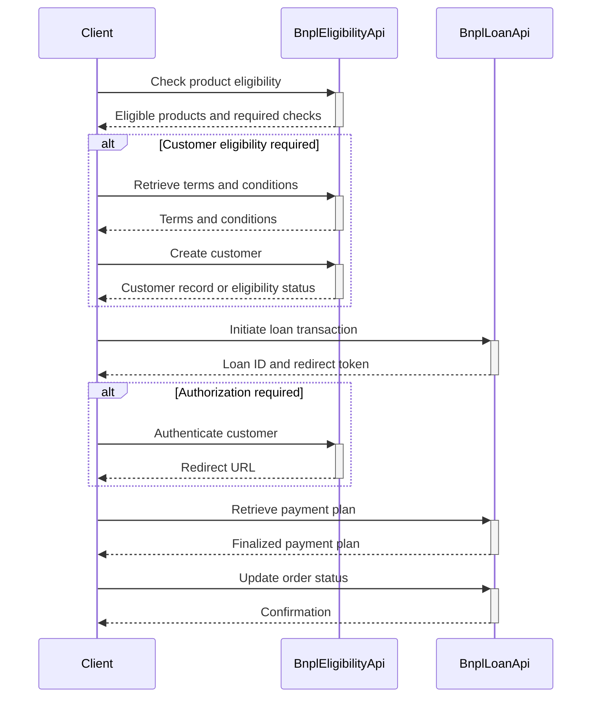

# BNPL Loan Application Workflow

### Version: 1.0.0

This workflow walks through the steps to apply for a BNPL loan at checkout, including checking product eligibility, retrieving terms and conditions, creating a customer record, initiating the loan transaction, customer authentication, and retrieving the finalized payment plan. It concludes by updating the order status once the transaction is complete.

---

## Metadata Table

| Attribute                     | Value                                                                                      |
|-------------------------------|--------------------------------------------------------------------------------------------|
| **Specification Version**     | 1.0.0                                                                                     |
| **Number of APIs Referenced** | 2 (`BnplEligibilityApi`, `BnplLoanApi`)                                                   |
| **Number of Workflows**       | 1                                                                                         |
| **Workflows Validity**        | Yes                                                                                       |
| **API Surface Area Coverage** | 100%                                                                                      |

---

## Workflow Overview: ApplyForLoanAtCheckout

**Summary**: This workflow applies for a BNPL loan at checkout using the BNPL platform.  
**Description**: The process includes verifying product and customer eligibility, initiating the loan transaction, retrieving payment plans, and updating order statuses.  

> **Developer Note:**  
> This workflow provides a complete sequence of API calls needed for BNPL loan application at checkout. Use it to streamline integration into your e-commerce or financial application.  

---

### Inputs

| Name      | Type          | Required | Description                                        |
|-----------|---------------|----------|----------------------------------------------------|
| customer  | `object`      | Yes      | Customer details or a URI to an existing record.  |
| products  | `array`       | Yes      | Array of products to be checked for BNPL loans.   |

**Customer Object Variants**:

| Properties           | Type     | Required | Description                                      |
|-----------------------|----------|----------|--------------------------------------------------|
| `firstName`          | `string` | Yes      | Customer's first name.                          |
| `lastName`           | `string` | Yes      | Customer's last name.                           |
| `dateOfBirth`        | `string` | Yes      | Customer's date of birth in `date-time` format. |
| `postalCode`         | `string` | Yes      | Customer's postal or ZIP code.                  |

**Product Properties**:

| Property              | Type     | Required | Description                  |
|-----------------------|----------|----------|------------------------------|
| `productCode`         | `string` | Yes      | Unique code for the product. |
| `purchaseAmount`      | `object` | Yes      | Details of the product price.|

`purchaseAmount` Object:

| Property     | Type     | Required | Description               |
|--------------|----------|----------|---------------------------|
| `currency`   | `string` | Yes      | Currency code (e.g., USD).|
| `amount`     | `number` | Yes      | Price in specified currency.|

> **Developer Tip:**  
> Ensure that the `customer` object conforms to one of the variants listed above. If using an existing customer, provide the `uri` property. For new customers, include their personal details as shown.  

---

### Workflow Steps

| Step ID                            | Description                                                                                     | Operation ID                                      | Outputs                                                                                       |
|------------------------------------|-------------------------------------------------------------------------------------------------|--------------------------------------------------|-----------------------------------------------------------------------------------------------|
| `checkProductEligibility`          | Checks whether selected products are eligible for BNPL loans.                                   | `findEligibleProducts` (BnplEligibilityApi)      | `eligibilityCheckRequired`, `eligibleProducts`, `totalLoanAmount`                             |
| `getCustomerTermsAndConditions`    | Retrieves terms and conditions for BNPL loans.                                                  | `getTermsAndConditions` (BnplEligibilityApi)     | `termsAndConditions`                                                                          |
| `createCustomer`                   | Creates a new customer record for BNPL loan eligibility.                                        | `createCustomer` (BnplEligibilityApi)           | `customer`                                                                                    |
| `initiateBnplTransaction`          | Initiates a BNPL loan transaction.                                                              | `createBnplTransaction` (BnplLoanApi)           | `redirectAuthToken`, `loanTransactionId`                                                     |
| `authenticateCustomerAndAuthorizeLoan` | Authenticates the customer and obtains authorization for the loan.                            | `getAuthorization` (BnplEligibilityApi)         | `redirectUrl`                                                                                 |
| `retrievePaymentPlan`              | Retrieves the finalized payment plan after loan authorization.                                  | `retrieveBnplLoanTransaction` (BnplLoanApi)     | `finalizedPaymentPlan`                                                                        |
| `updateOrderStatus`                | Updates the order status to "Completed" after loan finalization.                                | `updateBnplLoanTransactionStatus` (BnplLoanApi) | None                                                                                          |

> **Developer Note:**  
> Each step is carefully sequenced to ensure a smooth workflow. Refer to the "Outputs" column for values you can use as inputs in subsequent steps.  

---

### Workflow Outputs

| Name                   | Type          | Description                                       |
|------------------------|---------------|---------------------------------------------------|
| `finalizedPaymentPlan` | `object`      | Finalized payment plan returned by the workflow. |

> **Developer Insight:**  
> The `finalizedPaymentPlan` object includes all details of the payment schedule, making it a critical piece for presenting BNPL loan details to your customers.

---

### Workflow Diagram

**Mermaid Syntax for the Workflow:**

